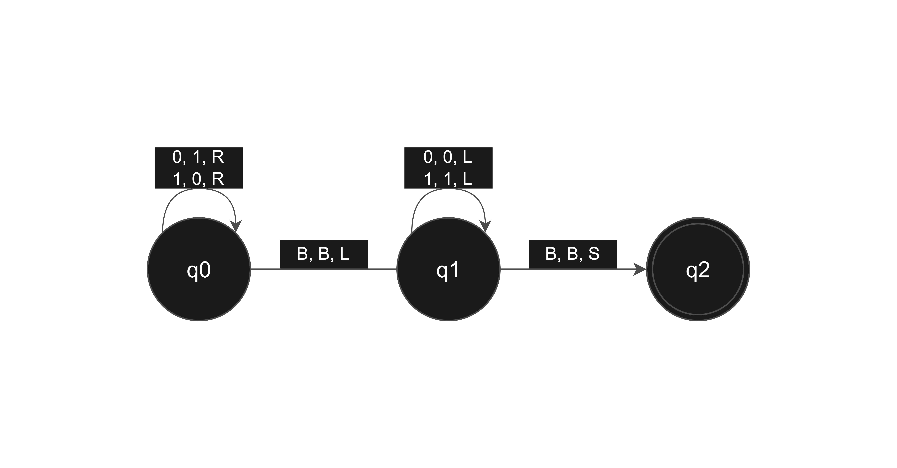
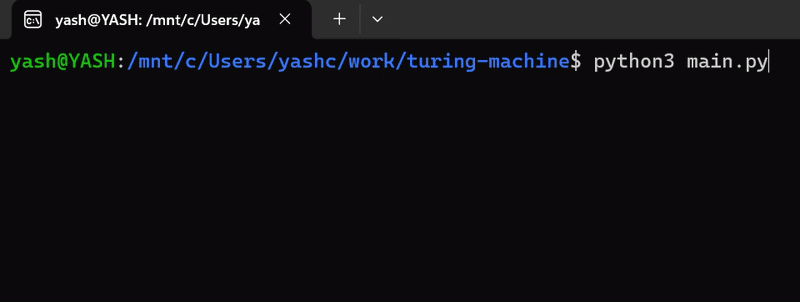

# Turing Machine

A Python implementation of a single-tape Turing Machine that calculates the 1's complement of a binary number (flipping 0s to 1s and 1s to 0s). It features a visual tape animation and a detailed history log.

# Transition Diagram

# Terminal output

